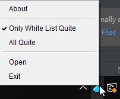

# SeeWordDrinkWater

# About The Project
In this project, I have developed a java application that remind user to drink water. As a programmer, I seldom leave my chair and code to the point of forgetting. So I develop this for myself. But Also, for you who should care more about yourself.
> This project is designed when I was a year 2 student. So bugs may occur and code logic is messy. I will improve it someday in the future.

## Features
1. Allow user keep tracking their water progress
   1. Target Progress Bar for today
      1. How much target remain
      2. Time to day end
   2. Calendar for selecting a period of time
      - Number of passing / failing the target
      - Green label for pass, Red label for Fail (See Below)
2. Quick add water volume 
   - Also provide add value in custom amount 
3. Beep sound and pop-up window when times-up
   1. Non-stop beeping provided
4. Do-not-distract mode and application whitelist
   - If selected application is open, beep sound and pop-up window will be disabled
   - So, you can still play game, or team meeting without distract
5. Can hide in Tray with right click function
6. Drink more water ^_^

# Getting Started
## Requirements

1. Java 8 is required (JDK 1.8)
2. A json file will be created next to the jar/exe. So place it well, it is the drinking record

## How to start
Choose one of the options below:
1. run SeeWordDrinkWater.jar
2. run SeeWordDrinkWater.exe
> Make sure you meet the above requirements

## Screenshot

### 1. Main Page

### 2. Option Menu

### 3. Task Manager (Do-not-distract mode / White List)

### 4. Calendar 

### 5. Remind drink water

### 6. Hide to Tray (and its functions) 

### 7. About

# TO-DO List
Since this project is designed when I was a year 2 student. Many things can be improved. However, I don't have time.
1. Improve code logic
    - the way how variable should be referenced
2. Better GUI
3. Unit-test, bugs may happen

## Reference I used, Thank you all
- [LGoodDatePicker]

[LGoodDatePicker]:<https://github.com/LGoodDatePicker/LGoodDatePicker/>
